# Support Automation — a no-code AI automation platform

A multi-tenant platform for building AI support agents **without writing
code**. You draw a flow on a canvas (or describe it in plain English), connect
your knowledge and your tools, and the platform runs it on every incoming
case: it retrieves context, triages, drafts a grounded reply, and then
**auto-replies, asks a human, or hands over**. That decision goes through a
confidence gate that is stricter for higher-value customers.

**The agent is data, not code.** Node types, edges, and per-node config live
in Postgres and are interpreted into a real LangGraph `StateGraph` at runtime.
The visual editor, the AI copilot, Mermaid import, and the CLI are all clients
of the same schema.

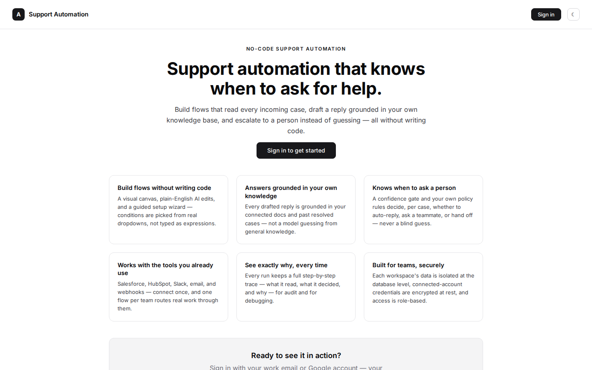

---

## Contents

- [Screenshots](#screenshots)
- [Features](#features)
- [Architecture](#architecture)
- [Node types](#node-types)
- [Tech stack](#tech-stack)
- [Getting started](#getting-started)
- [Running the full stack (Docker)](#running-the-full-stack-docker)
- [Testing](#testing)
- [Repository layout](#repository-layout)
- [Documentation](#documentation)
- [Project status](#project-status)

---

## Screenshots

> The screenshots were rendered from the real web app on mocked demo data
> (the same offline fixture approach as the Playwright e2e suite), so no
> customer data appears.

### Visual flow editor
Drag-and-drop canvas built on React Flow. Validation runs live: a node that
won't build is outlined in red, and edges carry named conditions.

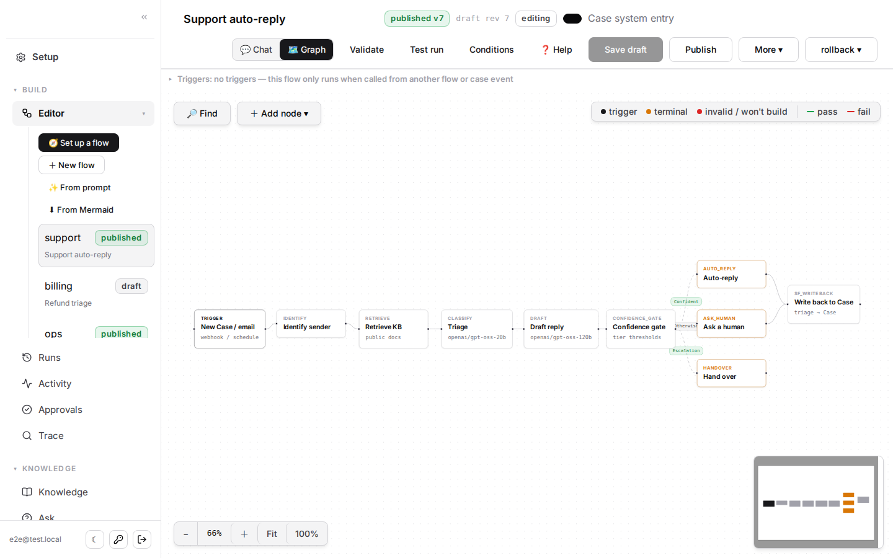

| Node inspector: per-tier confidence thresholds | Dark mode |
|---|---|
| 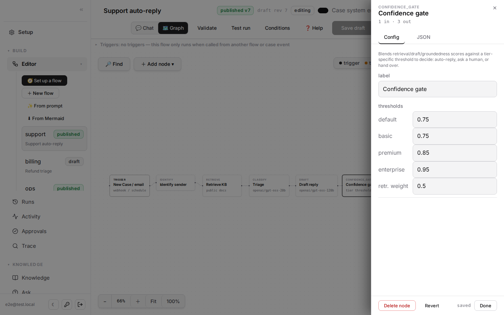 | 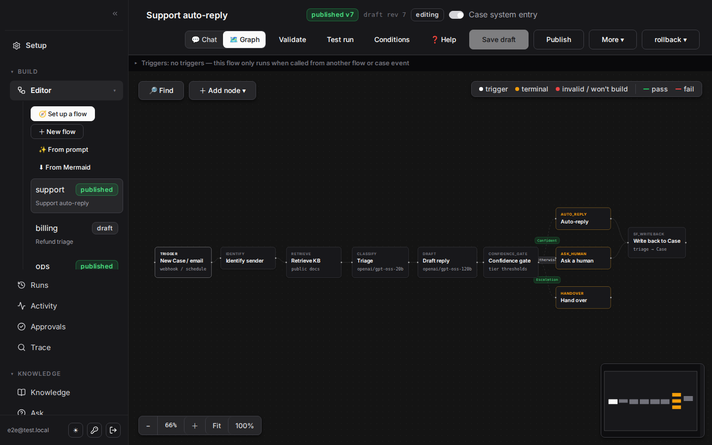 |

### AI copilot: edit a flow in plain English
Describe a change ("add a step that asks for the order number before
replying"). The AI rewrites the graph and shows a diff on the canvas, and
nothing is saved until you click **Save draft**.

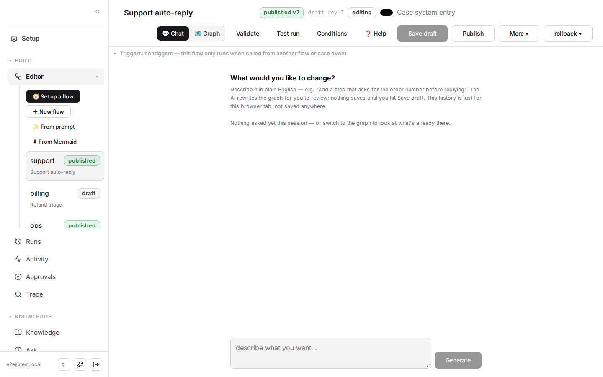

### Runs: every decision, explained
Outcome counts, per-tier breakdowns, confidence scores, and how often humans
kept the bot's draft. Open any run to see its full step-by-step trace.

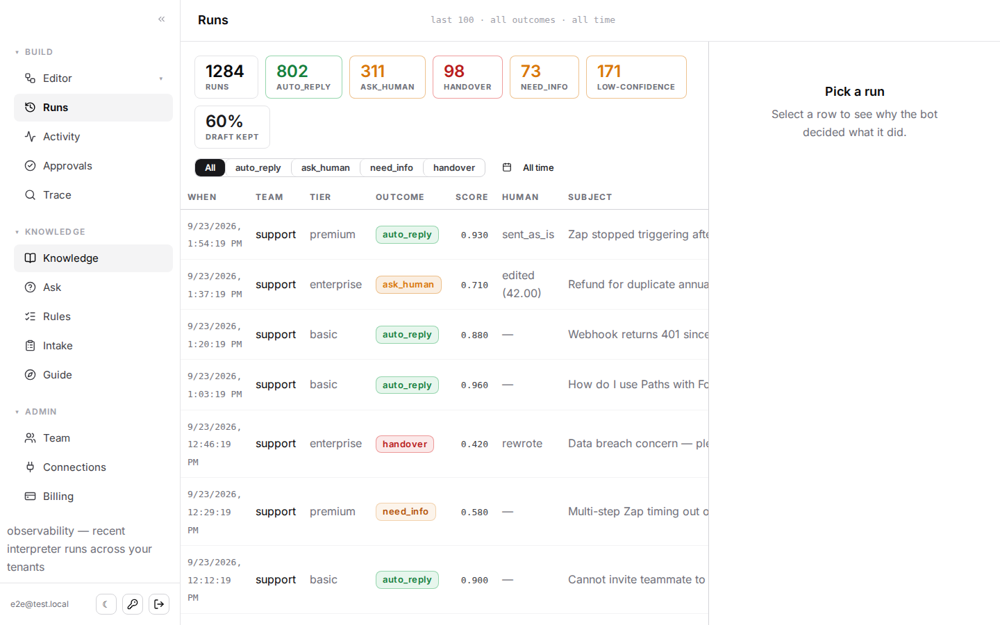

### Knowledge base
Per-team collections written in-app, uploaded (PDF/DOCX/MD/CSV), crawled
from a URL, or synced from Google Docs/Sheets. Entries flagged by the
Knowledge Integrity Loop show up as *held: disputed* until a manager reviews
them.

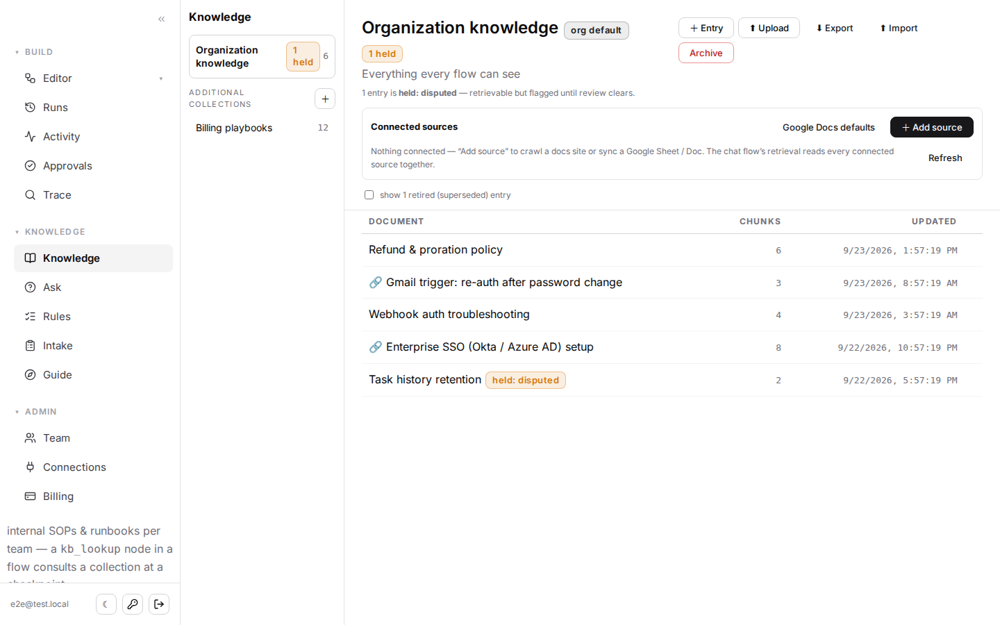

| Guided setup / health checklist | Connections & case-system routing |
|---|---|
| 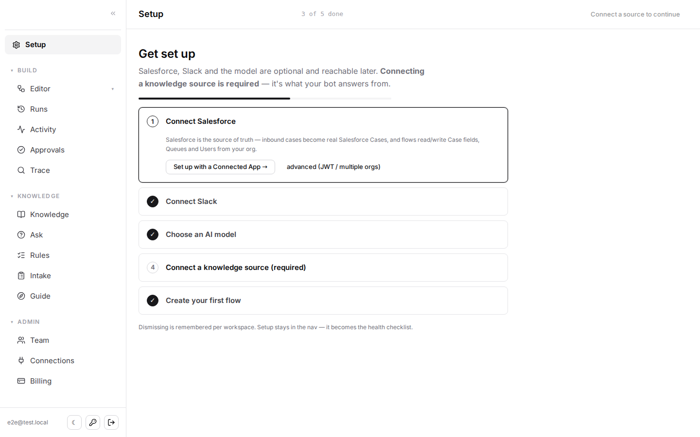 | 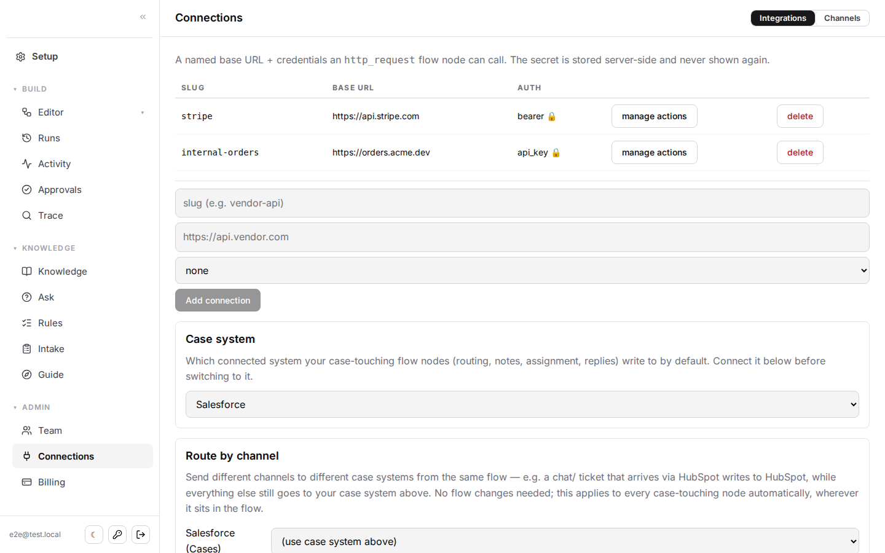 |

| Usage & billing | Audit log / activity |
|---|---|
| 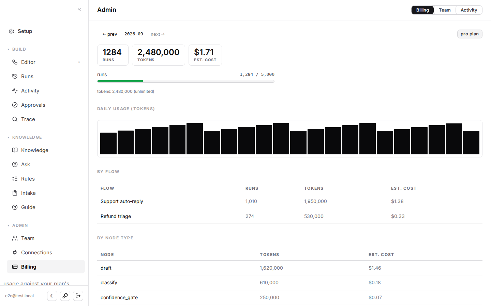 | 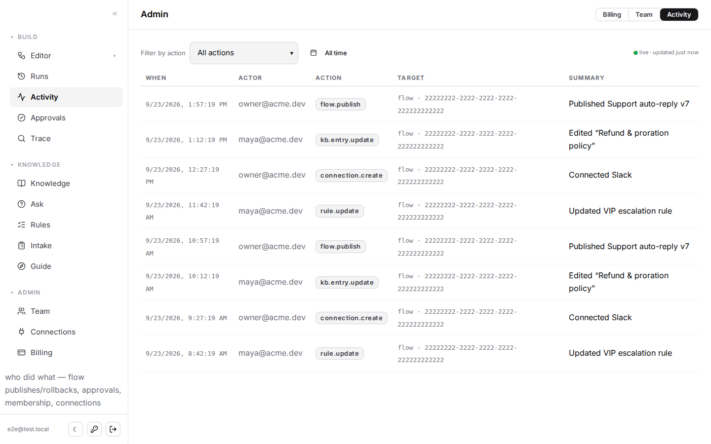 |

| In-app guide | Sign in (email magic link / Google) |
|---|---|
| 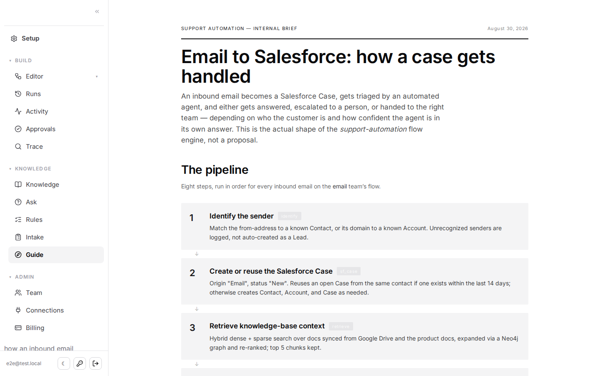 | 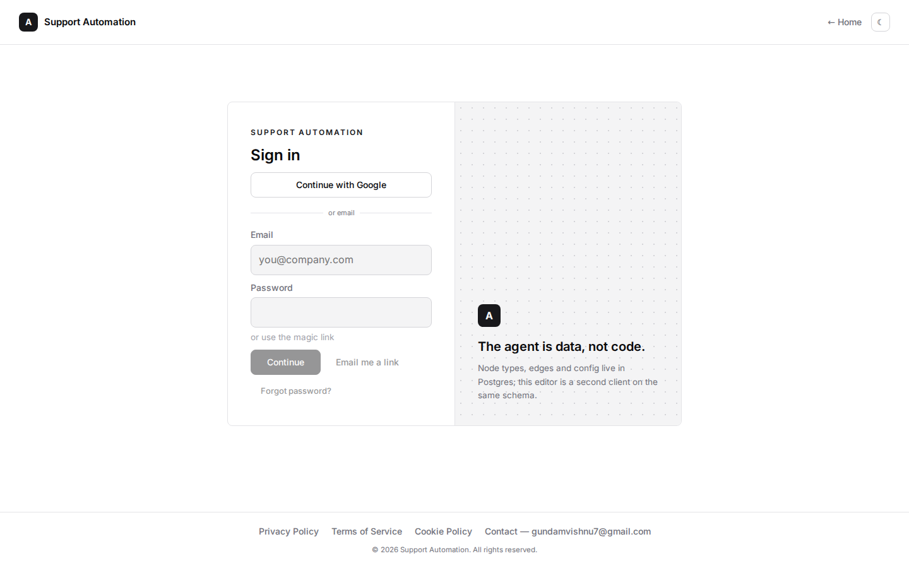 |

---

## Features

### Build flows without code
- **Visual flow editor** (React Flow): drag nodes, wire edges, edit config
  in a form-based inspector, pick real data (Salesforce queues, users, and
  fields; Slack channels; KB collections) from dropdowns instead of typing
  IDs.
- **Three ways to author a flow**: the canvas, **AI generate from a
  description / AI edit an existing flow** (with a reviewable diff), or
  **Mermaid import**. There is also a **guided "Set up a flow" wizard** and
  **templates** (support auto-reply, triage & route, draft-then-approve in
  Slack, webhook RAG Q&A).
- **Condition builder** for edges (tier, region, confidence, topic, urgency,
  routed team, policy action, extracted entities…), with named edges shown
  on the canvas.
- **Live validation**: referential integrity, cycle detection, and
  "won't build" warnings before you save.
- **Versioning**: immutable flow versions, publish/rollback, optimistic
  concurrency, and a transactional save.
- **Test run** a flow against a sample or a real past case from inside the
  editor.

### AI that knows when to ask for help
- **Hybrid retrieval**: dense (local `bge-small-en-v1.5` embeddings) plus
  sparse search, expanded through a **Neo4j knowledge graph** and re-ranked
  with a local cross-encoder.
- **Grounded drafting** with a groundedness check, plus a **per-tier
  confidence gate** (e.g. basic 0.75 / premium 0.85 / enterprise 0.95).
- **Agentic node**: a bounded ReAct-style loop that reformulates the search
  and retries only when the draft isn't grounded enough, so it spends more
  only on cases that would otherwise be escalated.
- **Low-confidence recovery**: a `clarify` node asks the customer the
  specific missing questions (capped at 2 rounds), and `identify` resolves
  the sender to a CRM contact or account.
- **Case-resolution memory**: answers draw on similar past *resolved* cases.
- **Multimodal**: OCR/transcription of image and video attachments.
- **Pick your model per node**: Groq (default: `gpt-oss-120b` for drafting,
  `gpt-oss-20b` for classification and judges), Anthropic Claude, or
  OpenRouter, with a live free-model roster. Workspaces can bring their own
  key (BYOK).

### Humans in the loop
- **Ask a human / hand over** with the draft attached, via Salesforce
  Chatter, Slack, or both.
- **Unified Approvals inbox**: KB-change diffs, Slack-approved internal
  tasks (e.g. create a GitHub issue), and flagged replies, in one place.
- **Feedback loop**: the platform records whether the human sent the draft
  as-is, edited it, or rewrote it. Accepted drafts become eval data and
  exemplars.
- **Slack reasoning sessions**: discuss a case with the bot in a Slack
  thread before anything is sent.

### Knowledge Integrity Loop (KIL)
Detects when an answer contradicts the knowledge base, routes the
contradiction to manager review, and publishes an approved KB rewrite. Also
includes provisional vs. confirmed entries, supersession, a weekly learning
digest in Slack, and KIL observability metrics.

### Channels & connectors
- **Channels**: email (Gmail OAuth or IMAP/SMTP, with loop-breakers and a
  hard auto-send guard), web form, Slack, **webhook triggers** (`POST
  /t/<token>`), and **cron schedules**.
- **Case systems**: **Salesforce** (JWT / OAuth "Connect Salesforce" button,
  multi-org, Case creation and thread-based reuse, field write-back,
  Omni-Channel routing, Change-Data-Capture watcher), **HubSpot** tickets,
  **Zendesk**, and **Freshchat**, with **per-channel routing** to a
  different case system from the same flow.
- **Knowledge sources**: Google Docs/Sheets, file upload, URL crawl, and
  public docs sitemaps (the reference domain is Zapier's developer docs).
- **Declarative connectors**: register any REST API (base URL plus
  bearer/API-key auth, secret stored in Supabase Vault) and call it from an
  `http_request` or `connector_action` node.
- **Generic runs**: flows don't have to be support cases. A webhook or
  schedule flow runs on an arbitrary `context` payload.

### Platform & SaaS
- **Multi-tenant by design**: every tenant-scoped table uses Postgres RLS
  via `tenant_members`, with **owner / editor / viewer** roles, email
  invitations, and workspace switching.
- **Auth**: Supabase magic link, Google sign-in, password set/reset, and
  rate-limited abuse protection.
- **Self-serve onboarding** with a setup wizard that becomes a health
  checklist.
- **Usage & billing**: per-flow and per-node token/run accounting, plan
  limits and enforcement, and Stripe / Razorpay subscriptions with trial,
  grace period, and cancel-at-period-end.
- **Observability**: a per-case unified timeline (`Trace`), a run-level
  "why did the bot do this", an audit log, a tenant health endpoint, Slack
  alerts, and optional **Sentry**.
- **Security**: bearer tokens verified against Supabase, per-user rate
  limiting, SSRF protection on crawls and connections, secrets in Supabase
  Vault (never returned to the browser), and a cross-tenant cache-leak
  audit.
- **Compliance pages**: Privacy Policy (DPDPA, GDPR, CCPA/CPRA), Terms, and
  Cookie Policy, with consent-gated GTM/GA4.
- **Design**: a shadcn-style neutral design system with real light and dark
  themes.

---

## Architecture

```
 Channels / triggers                 Platform                                 Systems
 ───────────────────                 ────────                                 ───────
 Email (IMAP/Gmail) ─┐                                                   ┌─ Salesforce / HubSpot /
 Salesforce CDC ─────┤   ┌──────────┐   ┌───────────────────────────┐    │  Zendesk / Freshchat
 HubSpot tickets ────┼──▶│ jobs     │──▶│ worker → interpreter      │───▶├─ Slack (Chatter / DM /
 Webhook /t/<token> ─┤   │ queue    │   │  flow row (Postgres)      │    │  approvals)
 Cron schedule ──────┤   │ (SKIP    │   │   → LangGraph StateGraph  │    ├─ Email (SMTP / Gmail)
 Web form / API ─────┘   │  LOCKED) │   │   → node registry         │    └─ Any REST API (connectors)
                         └──────────┘   └──────────┬────────────────┘
                                                   │
          React Flow editor ◀── FastAPI (api/) ────┤  runs · trace · audit · billing
                                                   │
                         Supabase Postgres + pgvector + Vault + RLS     Neo4j (doc/case graph)
```

- **`interpreter/`**: loads a flow from Supabase, validates it, and compiles
  it into a LangGraph `StateGraph`. Edge conditions are evaluated with a safe
  AST evaluator. Each node type is a handler in a registry, configured by
  `config` jsonb. Node types are generic strings, not an enum.
- **`api/`**: a FastAPI backend over the same interpreter, plus a job
  worker (`claim_job()` with `FOR UPDATE SKIP LOCKED`, idempotency keys, and
  retry with backoff).
- **`ingestion/`**: pollers and sync jobs (email, Salesforce CDC, HubSpot,
  web crawl, docs scraper, Neo4j sync, case-memory sync).
- **`web/`**: a React + Vite + React Flow single-page app on Supabase Auth.

---

## Node types

| Group | Nodes |
|---|---|
| **Entry & context** | `trigger` (webhook/schedule), `identify` (sender → contact/account), `sf_case` (create/reuse Case), `sf_context` (account / case history), `case_lookup` (similar resolved cases), `product_signal`, `attachments` (OCR / transcription) |
| **Understand** | `classify` (tier, topic, urgency), `extract` (named fields), `team_route`, `policy_gate` (when→then rules) |
| **Knowledge** | `retrieve` (hybrid + graph), `kb_lookup` (internal runbooks), `correction_exemplars` |
| **Generate** | `draft` (grounded reply), `agent` (self-retrying retrieve+draft), `ai_prompt` (custom LLM step), `transform` (no-LLM reshape) |
| **Decide** | `confidence_gate` (per-tier threshold, pass/fail branch) |
| **Act** | `auto_reply`, `ask_human`, `handover`, `clarify`, `notify`, `notify_human`, `sf_writeback`, `http_request`, `connector_action`, `task_dispatch` (Slack-approved task) |

See [`docs/FLOW_AUTHORING.md`](docs/FLOW_AUTHORING.md) and the in-app
**Guide** for details on each node.

---

## Tech stack

| Layer | Tech |
|---|---|
| Orchestration | Python, **LangGraph** (`StateGraph` built at runtime from config) |
| API / workers | **FastAPI**, Uvicorn, a Postgres-backed job queue |
| Database | **Supabase** (Postgres, pgvector, RLS, Vault, Auth) |
| Graph | **Neo4j** Aura (doc links, case graph) |
| Embeddings / rerank | `fastembed` (ONNX `bge-small-en-v1.5`, CPU only) + a local cross-encoder |
| LLMs | **Groq** (default), **Anthropic Claude**, OpenRouter |
| Frontend | **React**, TypeScript, Vite, **React Flow**, a hand-built component kit |
| Integrations | Salesforce, HubSpot, Zendesk, Freshchat, Slack, Gmail/IMAP/SMTP, Google Docs/Sheets, GitHub, Stripe, Razorpay |
| Ops | Docker Compose, GitHub Actions (CI, daily sync, email automation), Sentry |
| Tests | pytest (offline + `-m integration`), Playwright e2e (fully mocked, zero secrets) |

The project runs on free and local tooling by default: local embeddings,
Groq's free models, and the free tiers of Supabase and Neo4j.

---

## Getting started

### Prerequisites
- Python 3.12 and Node 24 (the versions CI uses)
- A Supabase project (apply `db/migrations/*.sql` in order; see below)
- Optional: Neo4j Aura, a Groq API key, a Salesforce Developer Edition org,
  and a Slack app

### 1. Backend

```bash
python -m venv venv && venv/bin/pip install -r requirements.txt
cp .env.example .env     # fill SUPABASE_URL / SUPABASE_SERVICE_KEY / GROQ_API_KEY (others optional)
```

**Migrations are applied by hand**, in order, through the Supabase SQL
editor (or the Supabase MCP `apply_migration`). The `.sql` files in
`db/migrations/` are the source of truth. Don't use `supabase db push`.
`scripts/verify_migrations.py` diffs them against the live schema.

### 2. Run a flow from the CLI

Without Salesforce or LLM credentials, the interpreter uses a stub LLM and a
Salesforce dry-run:

```bash
python -m interpreter.run --list
python -m interpreter.run --flow 11111111-1111-1111-1111-111111111111 \
  --case interpreter/cases/basic_howto.json
```

### 3. API + web app

```bash
uvicorn api.main:app --reload            # API on :8000
cd web && cp .env.example .env.local && npm install && npm run dev   # UI on :5173
```

---

## Running the full stack (Docker)

`docker-compose.yml` runs every long-lived process from one image:

| Service | Command | Role |
|---|---|---|
| `api` | `uvicorn api.main:app` | REST API on `:8000` |
| `worker` | `python -m api.worker` | runs queued flow jobs and periodic sweeps (schedules, KIL, sync) |
| `poller` | `python -m ingestion.email_watch` | inbound email → jobs |
| `cdc` | `python -m ingestion.sf_cdc_watch` | Salesforce Change-Data-Capture → jobs |
| `hubspot_watch` | `python -m ingestion.hubspot_ticket_watch` | HubSpot tickets → jobs |
| `slackbot` | `python -m interpreter.slack_socket` | Slack Socket Mode (approvals, reasoning threads) |

```bash
docker compose up -d --build
```

Deployment guides: [`docs/DEPLOY.md`](docs/DEPLOY.md),
[`docs/DEPLOY_WEB_AND_API.md`](docs/DEPLOY_WEB_AND_API.md),
[`docs/DEPLOY_ORACLE.md`](docs/DEPLOY_ORACLE.md),
[`docs/LOCAL_RUNTIME.md`](docs/LOCAL_RUNTIME.md).

---

## Testing

```bash
venv/bin/pytest                         # offline unit tests (no secrets needed)
venv/bin/pytest -m integration          # live Supabase / Salesforce / Slack (self-skips without creds)
python -m ingestion.eval.run_eval       # retrieval eval
cd web && npm run build && npx playwright test   # type-check + fully-mocked browser e2e
```

CI (`.github/workflows/ci.yml`) runs the offline suite, a migration-drift
check, integration tests when secrets are present, and the Playwright e2e
suite. There are also end-to-end action evals under `eval/` (auto-send and
escalation precision, and a threshold sweep).

---

## Repository layout

| Path | What |
|---|---|
| `interpreter/` | the config-driven LangGraph interpreter: loader, builder, node registry, conditions, retrieval, LLM router, Salesforce and other connectors, runs, billing, approvals, triggers, cron, templates, KIL |
| `interpreter/flows/` | `validate_flow.py`, AI assist / Mermaid import, flow templates |
| `api/` | FastAPI backend (`main.py`), job worker (`worker.py`), per-case trace |
| `ingestion/` | email / Salesforce CDC / HubSpot watchers, web crawl, docs scraper, Neo4j + case-memory sync, retrieval eval |
| `web/` | React + React Flow app, organized by feature (`flows`, `runs`, `kb`, `rules`, `review`, `trace`, `billing`, `team`, `channels`, `onboarding`, `landing`, …) |
| `db/migrations/` | sequential, single-concern SQL migrations |
| `scripts/` | ops helpers: Salesforce setup, seed data, RLS check, migration drift, health check |
| `tests/` | pytest suites: offline plus `-m integration` |
| `eval/` | end-to-end action / review / write-back evals |
| `deploy/` | deployment helpers |
| `docs/` | specs, the build log, and setup guides |

---

## Documentation

| Doc | About |
|---|---|
| [`docs/PROJECT_SCOPE.md`](docs/PROJECT_SCOPE.md) | **the build log**: every phase, what it delivered, how it was verified, and the immediate next step |
| [`docs/REQUIREMENTS.md`](docs/REQUIREMENTS.md) | the spec: numbered functional and non-functional requirements |
| [`docs/FLOW_AUTHORING.md`](docs/FLOW_AUTHORING.md) | canvas, AI generate/edit, Mermaid import |
| [`docs/DASHBOARD_GUIDE.md`](docs/DASHBOARD_GUIDE.md) | using the web app |
| [`docs/MULTI_SYSTEM_ARCHITECTURE.md`](docs/MULTI_SYSTEM_ARCHITECTURE.md) | multi-connector / multi-case-system design |
| [`docs/SALESFORCE_SETUP.md`](docs/SALESFORCE_SETUP.md) · [`CASE_CONTROL_PLANE_SF.md`](docs/CASE_CONTROL_PLANE_SF.md) | Salesforce connection and org setup |
| [`docs/EMAIL_SETUP.md`](docs/EMAIL_SETUP.md) · [`SLACK_SETUP.md`](docs/SLACK_SETUP.md) · [`GOOGLE_SETUP.md`](docs/GOOGLE_SETUP.md) | channel and connector setup |
| [`docs/KB_SOURCE_CONNECTORS.md`](docs/KB_SOURCE_CONNECTORS.md) · [`GRAPH_QUERY.md`](docs/GRAPH_QUERY.md) | knowledge sources, Neo4j graph |
| [`docs/BILLING_SETUP.md`](docs/BILLING_SETUP.md) · [`PRODUCT_ANALYTICS_CONNECTOR.md`](docs/PRODUCT_ANALYTICS_CONNECTOR.md) | billing, product analytics |

---

## Project status

The project was built in sequenced, individually verified phases:
**MVP** (schema → interpreter → Salesforce → multi-tenant → editor →
observability), then **hardening** (evals and calibration, versioning, CI,
event-driven jobs, feedback loop, security), **self-serve knowledge and
connectors**, the **Knowledge Integrity Loop**, a **platform-hardening
roadmap** (generic runs, webhook/cron triggers, declarative connectors,
onboarding, billing), and **agentic AI** (tool calling, the `agent` node,
multi-hop retrieval). The latest work is SaaS readiness: auth hardening,
billing, audit log, error monitoring, and compliance pages.

[`docs/PROJECT_SCOPE.md`](docs/PROJECT_SCOPE.md) has the authoritative,
up-to-date status and the "Immediate next step".
